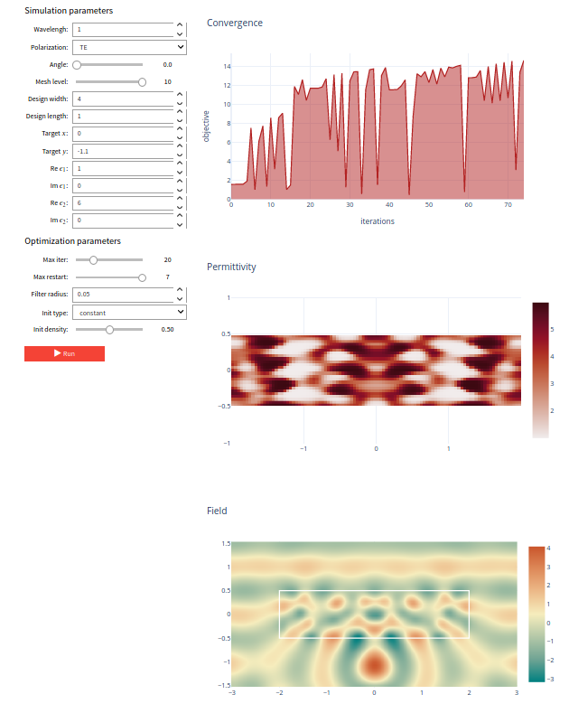

# TopOpt App

**A web application for the topology optimization of an optical lens.**

## Try it live

Click the binder badge to try it live without installing anything. This will take you directly to the "app" version of the Jupyter notebook.
